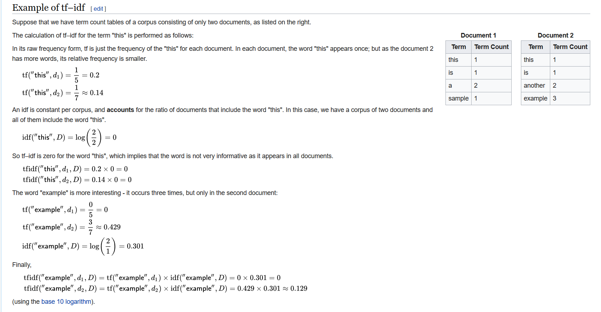

# Information Search Engine 

## Objectives

* Implement an information retrieval system using well known tf-idf measures
* Practice with data structures, creating own functions and algorithms

## Aim

The project implements an information retrieval system using well known term-weighting scheme called "tf-idf". 
For further information about the tf-idf please visit the wikipedia article:

### Tf-idf Link
[tf-idf](https://en.wikipedia.org/wiki/Tf%E2%80%93idf)

### Steps involved

* Calculates the relative frequency tf(t,d) adjusted for document length (d). tf(t, d) = (frequency of term t in d) / (number of words in d).

* Calculates inverse document frequency idf(t, D) by dividing the total number of documents by the number of documents containing the term, and then taking the logarithm of that quotient:

     ### idf(this, D) = log(N / |{d ∈ D : t ∈ d}| )


* Calculates tfidf(t, d) = tf(t,d) * idf(t,D)

### Example from Wikipedia:

<!-- Images -->


# Part 1 - Inverted Index and BST

Implementation of functions in the file invertedIndex.c that reads data from a given collection of files in collection.txt (see simple example files in repo with .txt) and generates an "inverted index" that provides a sorted list (set) of filenames for every word in a given collection of files. The program uses a binary search Tree to implement the inverted index.

The functions in invertedIndex.h:

```C

char * normaliseWord(char *str);
InvertedIndexBST generateInvertedIndex(char *collectionFilename);
void printInvertedIndex(InvertedIndexBST tree);

```


Before inserting words into the linked list, the function, 
```C
char * normaliseWord(char *str);
```


normalises each word in each file containing the following symbols:
* '.' (dot),
* ',' (comma),
* ';' (semicolon),
* ? (question mark)

It also:

* Removes leading and trailing spaces
* Converts all characters to lowercase

Note: If multiple symbols appear in the word only the first one is removed from the word. The function will only remove symbols at the end of the word. The function modifies a given string. It does not create a copy.

### Example

| Word (input) | Normalised Word (output) |
| :---        |    :----:   | 
| LukaGamulin.      | lukagamulin       | 
| Luka?             | luka        |
| LukaJose??          |  lukajose?         |
| Luka.Jose?  | luka.jose |

The function generateInvertedIndex ,
```C
InvertedIndexBST generateInvertedIndex(char *collectionFilename);
```
Takes in as input a collection of filenames, reads each of these files, generates and returns the inverted index. This is where the magic happens. The tree data structure is created where every node is a word and every word has a list, containing every file where the word appeared from the collection filename.

Each node has a tf-idf number, the list is sorted from highest to lowest tf-idf.

Finally, the function printInvertedIndex, 
```C
void printInvertedIndex(InvertedIndexBST tree);
```

Takes in the ADT implemented in the function generateInvertedIndex and prints the tree. 

### Example output format

    design file11.txt file21.txt
    mars nasa.txt news1.txt
    weather info31.txt nasa.txt news1.txt

# Part 2 - Information Retrieval Search engine

 In this part, the information retrieval uses a function that finds files (documents) with one or more query terms, and uses summation of tf-idf values of all matching query terms (words) for ranking such files (documents). It calculates the  tf-idf values for each matching query term in a file (document), and ranks the files (documents) based on the summation of tf-idf values for all matching query terms present in that file. It uses the ADT "inverted index" created in Part-1 to locate files with one or more query terms, and to calculate the required tf-idf values for such files.

The information retrieval engine in this part implements a function in the file invertedIndex.c that given search terms (words), returns an ordered list of type TfIdfList, where each node contains filename and the corresponding summation of tf-idf values for given searchWords. The output list is in descending order of summation of tf-idf values. 

See invertedIndex.h for the type definition of TfIdfList. There are other functions to calculateTfIdf.

The following two functions in the file invertedIndex.c. Total number of documents D is provided as an argument in both the functions.
```C
TfIdfList calculateTfIdf(InvertedIndexBST tree,
                        char *searchWord , int D);
```    
The function returns an ordered list where each node contains filename and the corresponding tf-idf value for a given searchWord. It only returns documents (files) that contain a given searchWord. The list is in descending order of tf-idf values. 

Note: If the word contains multiple files with the same tf-idf value, it orders such files (documents) on their filenames using ascending order.

```C
TfIdfList retrieve(InvertedIndexBST tree, char* searchWords[] ,
                                         int D);
```

The function returns an ordered list where each node contains filename and summation of tf-idf values of all matching searchWords. Only returns documents (files) that contain one or more searchWords.

The list returns in descending order of summation of tf-idf values (tfidf_sum). If multiple files with same tfidf_sum value, the files (documents) are ordered on their filenames using ascending order. 

Note: the searchWords[] needs to be terminated with a NULL pointer. For example,

    char *words[] = { "nasa", "mars", "earth", NULL };
    TfIdfList list = retrieve(index, words, 7);

For compiling, create a new directory with all files in the repository. Then simply use the following command to compile,

    % gcc -Wall -Werror -lm -std=c11  *.c  -o invertedIndex

